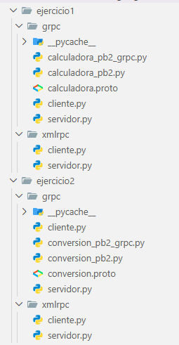

# TareaRPC en Python (XML-RPC y gRPC)
## 👩‍💻 Elaborado por
* Emily Galeas

## 📌 1. OBJETIVOS

- Aplicar conocimientos sobre RPC en Python utilizando XML-RPC y gRPC.
- Implementar comunicación cliente-servidor mediante llamadas remotas.
- Desarrollar servicios remotos para operaciones matemáticas y conversión de temperatura.

---

## 📃 2. DESCRIPCIÓN

En este proyecto se desarrollaron ejercicios utilizando tecnologías RPC en Python, implementados con XML-RPC y gRPC.

Los ejercicios realizados fueron:

- Calculadora con operaciones de suma, resta, multiplicación y división.
- Conversor de temperatura de Celsius a Fahrenheit, y viceversa.

---
## 💻 3. ESTRUCTURA DEL PROYECTO

